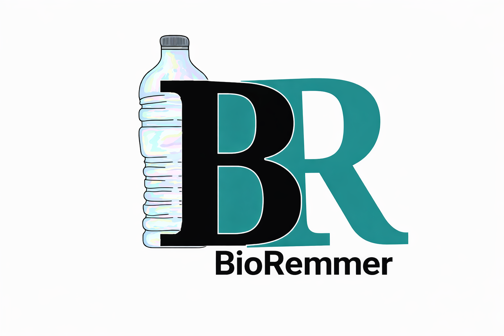

<div align="center">



# BioRemmer

**A bioinformatics pipeline for the identification of functional profiles in plastic microbial biodegradation**

[](https://www.gnu.org/licenses/gpl-3.0)
[](https://github.com/BiosLS/BioRemmer/releases/tag/v1.0)
[]()
[]()

</div>

---

## Overview

**BioRemmer** is an automated, end-to-end metagenomic pipeline designed to characterize the plastic-degrading potential of microbial communities. Starting from raw paired-end FASTQ reads, BioRemmer performs quality control, assembly, functional annotation, phylogenomic classification, taxonomic profiling, COG classification, and targeted enzyme homology searches — producing an interactive HTML report with publication-ready figures.

### Key features

- **Automated resume** — each step is skipped if its output already exists
- **Plastic-degrading enzyme search** — HMMER3 profiles for 9 plastic types (PET, PE, PUR, PS, IP, PA, PBAT, PHB, PLA)
- **Phylogenomics** — VAMPhyRE fingerprint-based NJ tree integrating MAGs and reference genomes
- **COG functional context** — highlights metabolic categories linked to plastic degradation
- **Heatmap analysis** — cross-references HMMER hits, taxonomy, and COG annotations
- **HTML report** — fully automated R Markdown report with interactive tables and figures

---

## Pipeline overview

```
Raw FASTQ reads
     │
     ▼
Step 1 ── Input validation
Step 2 ── Quality control          fastp
Step 3 ── Metagenome assembly      metaSPAdes
Step 4 ── Functional annotation    Prokka
Step 5 ── MAG binning              MetaBat2
Step 6 ── Phylogenomics            VAMPhyRE + build_tree.R
Step 7 ── Enzyme search            HMMER3 (9 plastic HMM profiles)
Step 8 ── COG classification       RPS-BLAST + cog_counter.py
Step 9 ── Taxonomic assignment     Metaxa2
Step 10 ── HTML report             R Markdown
Step 11 ── Plastic heatmap         plastic_heatmap.py
```

---

## Requirements

- Linux or WSL2 (Ubuntu 20.04/22.04)
- [Miniconda3](https://docs.conda.io/en/latest/miniconda.html)
- ~20 GB disk space (databases + results)
- ≥8 GB RAM recommended

---

## Installation

### 1. Clone the repository

```bash
git clone https://github.com/BiosLS/BioRemmer.git
cd BioRemmer
```

### 2. Download large files (Google Drive)

The following resources are hosted on Google Drive due to their size.
Download and place them in the indicated directories:

| Resource | Size | Destination |
|---|---|---|
| Reference genomes (genome_DB) | ~2 GB | `bin/vamphyre/genomes/genome_DB/` |
| COG database (COG_LE) | ~500 MB | `databases/COG_LE/` |
| Test FASTQ files | ~300 MB | `test/` |

> 📁 **All large files are available in a single Google Drive folder:**
> **[BioRemmer Data — Google Drive](https://drive.google.com/drive/folders/1hnfoMZ4AN5FJ7vRIaI1gNZiLd27h45Vc?usp=sharing)**
>
> Download the folder and place each subfolder in its corresponding destination above.

After downloading, verify the structure:
```bash
ls bin/vamphyre/genomes/genome_DB/*.fna | wc -l   # should show 40
ls databases/COG_LE/Cog.*                          # should show 9 files
ls test/*.fastq.gz                                 # should show 6 files
```

### 3. Create conda environments

```bash
# Core bioinformatics tools
mamba env create -f install/environment_bioremmer_core_v3.yml

# R report environment
bash install/install_bioremmer_r_v3.sh
```

### 4. Install v3 dependencies (fastp + Python packages)

```bash
bash install/install_bioremmer_v3.sh
```

---

## Usage

```bash
bash biorem_pipeline_v3.sh <R1.fastq.gz> <R2.fastq.gz> <sample_name> <threads>
```

### Example with test data

```bash
bash biorem_pipeline_v3.sh \
    test/Test_short_1.fastq.gz \
    test/Test_short_2.fastq.gz \
    test_short 4
```

### Resume a stopped run

The pipeline automatically skips completed steps. To rerun a specific step, delete its output:

```bash
rm -rf Results/SPAdes_results    # reruns step 3
rm -rf Results/Prokka_results    # reruns step 4
rm -rf Results/VAMPhyRE          # reruns step 6
rm -rf Results/HMMER             # reruns step 7
rm -rf Results/COG               # reruns step 8
rm -rf Results/Metaxa2_results   # reruns step 9
rm -f  Results/Biorem_report.html # reruns step 10
rm -f  Results/Plots/plastic_degrading_heatmap.png  # reruns step 11
```

---

## Output

All results are written to `Results/`:

```
Results/
├── Biorem_report.html          ← Main HTML report
├── Plots/                      ← Publication-ready figures
│   ├── plastic_degrading_heatmap.png
│   ├── cog_plastic_highlighted.png
│   ├── plastic_degrading_enzymes.png
│   ├── taxonomic_abundance.png
│   └── Phylogenomic_classification.png
├── Trimmomatic/                ← fastp QC outputs
├── SPAdes_results/             ← Assembly
├── Prokka_results/             ← Annotation
├── MetaBat2/                   ← MAG bins
├── VAMPhyRE/                   ← Phylogenomic tree
├── HMMER/                      ← Enzyme homology search
├── COG/                        ← COG classification
├── Metaxa2_results/            ← Taxonomic assignment
├── QC/                         ← fastp HTML report
└── logs/                       ← Run logs
```

---

## Repository structure

```
BioRemmer/
├── biorem_pipeline_v3.sh       ← Main pipeline script
├── config.sh                   ← Path configuration
├── scripts/                    ← Analysis and report scripts
│   ├── Biorem_report.Rmd       ← R Markdown report template
│   ├── report.R                ← Report renderer
│   ├── build_tree.R            ← NJ tree builder
│   ├── cog_counter.py          ← COG frequency counter
│   ├── plastic_heatmap.py      ← Heatmap generator
│   ├── fix_meg.py              ← VAMPhyRE output formatter
│   └── parse_cog_rpsblast.py   ← COG blast parser
├── install/                    ← Installation scripts and YMLs
├── databases/
│   ├── pfam/                   ← HMM profiles (9 plastic types)
│   └── BioRemDB.csv            ← Plastic degradation reference DB
├── bin/vamphyre/               ← VAMPhyRE binaries and probes
├── assets/                     ← Logo and report assets
└── test/                       ← Test FASTQ files (via Google Drive)
```

---

## Supported plastic types

| Code | Plastic |
|---|---|
| PET | Polyethylene terephthalate |
| PE | Polyethylene |
| PUR | Polyurethane |
| PS | Polystyrene |
| IP | Isoprene |
| PA | Polyamide |
| PBAT | Polybutylene adipate terephthalate |
| PHB | Polyhydroxybutyrate |
| PLA | Polylactic acid |

---

## Citation

If you use BioRemmer in your research, please cite:

> Cano-Sánchez J, Méndez-Tenorio A, Maldonado-Rodríguez R, Díaz-Ocampo E, Larios-Serrato V.
> **BioRemmer: a pipeline for the identification of functional profiles for plastic microbial biodegradation.**
> *(manuscript in preparation)*

---

## Authors

- José Cano-Sánchez
- Alfonso Méndez-Tenorio
- Rogelio Maldonado-Rodríguez
- Enrique Díaz-Ocampo
- Violeta Larios-Serrato ✉ viosdatafactory@gmail.com

---

## License

This project is licensed under the GNU General Public License v3.0 — see the [LICENSE](LICENSE) file for details.
